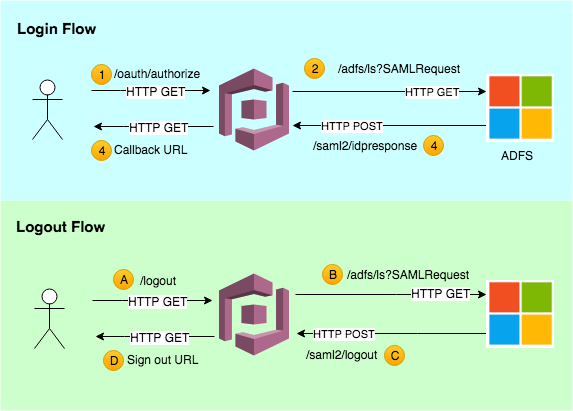
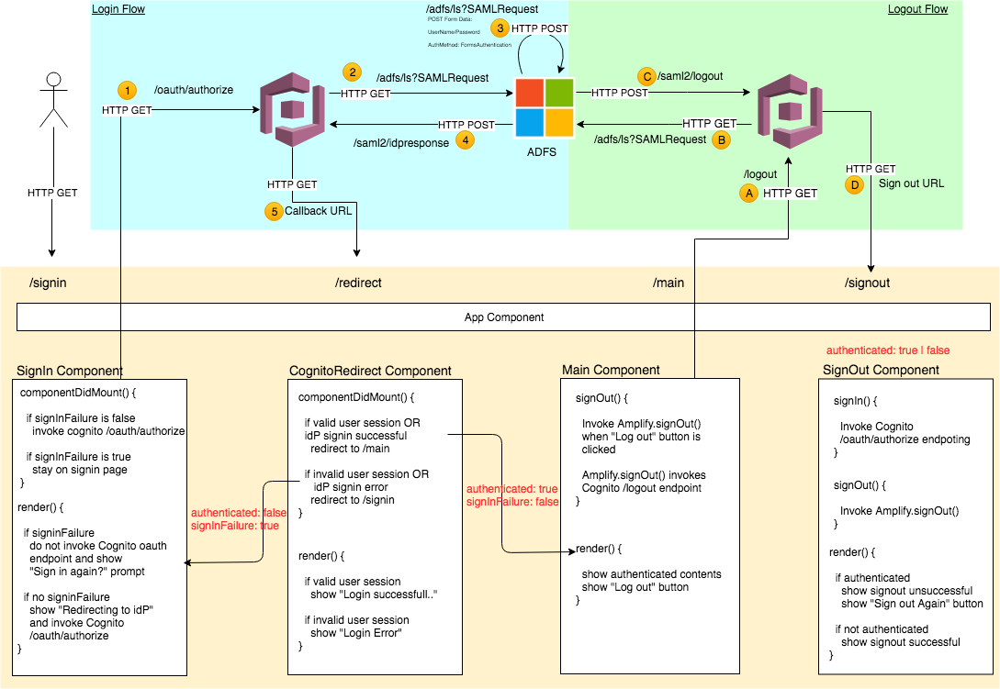
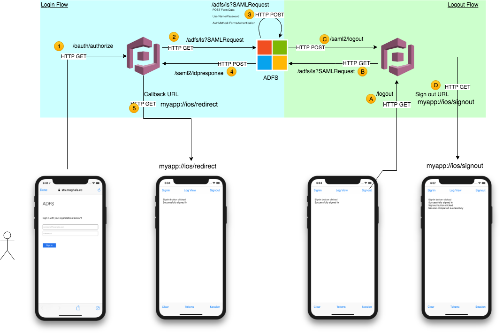

# Table of Contents
* [Overview](#overview)
* [Identity Provider Setup](#identity-provider-setup)
* [Cognito Setup](#cognito-setup)
* [Web Application Developer Guide](#web-application-developer-guide)
* [Native Application Developer Guide](#native-application-developer-guide)

# Overview

Sample web application provided in this repo demonstrates how to use AWS Amplify with a Cognito User Pool which is integrated with a SAML identity provider (ADFS).  Before the web application can be used, Cognito and ADFS must be configured properly.  This document:

- Outlines steps necessary to configure ADFS for Cognito User Pool integration
- Highlights necessary configuration that must be done in Cognito User Pool and Cognito Identity Pool
- Demonstrates how it is possible to avoid using Cognito Hosted UI in a web application
- Show cases the power of AWS Amplify for web applications and how easy it is to integrate with Cognito User Pool for Authentication

An highlevel overview of Cognito <> ADFS <> User interactions is shown in the diagram below.  In [Identity Provider Setup](#identity-provider-setup) and [Cognito Setup](#cognito-setup) sections, below, we will standup the ADFS infrastructure and configure both ADFS and Cognito.

But first, let's dive slightly deeper into both the login and logout flows and understand the various interactions between Cognito (relaying party or RP) and ADFS (oauth provider or OP).  Refer to 




## Login Flow

1. Login flow starts with user (or application) invoking Cognito `/login` end-point; user is redirected to Cognito Hosted UI.  Alternatively, user (or application) can directly trigger the federated sign-in process by invoking Cognito end-point `/oauth/authorize`.  Refer to [Cognito Endpoints][cognito-auth-endpoints].
2. Cognito redirects the user to ADFS login screen
3. Upon successful login, user is redirect back to Cognito based on the RP configuration done inside [ADFS](#identity-provider-setup) (more to come on this later)
4. Cognito captures the SAML token and claims sent from ADFS, populates (or update) the user and group information in user pool.  Cognito finally invokes the "Callback URL" that is configured in the [Cognito](#cognito-setup) application client setting (again, lots of details to come below)

## Logout Flow

- A) During the logout flow, user (or application) invokes Cognito's `/logout` end-point
- B) Cognito invokes ADFS `SAML Logout Endpoint Trusted URL` with a signed SAML sign-out request.  
- C) ADFS signs out the user and invokes the `SAML Logout Endpoint Response URL`.  This response URL is Cognito's SAML logout endpoint (more details in [ADFS](#identity-provider-setup) section)
- D) Cognito invalidates user session and finally redirects the user to application `Sign out URL` configured in the [Cognito](#cognito-setup) application client setting


# Identity Provider Setup

A SAML Identity Provider (idP), i.e. ADFS, must be properly configured such that Amazon Cognito can receive SAML request from idP for authentication and user pool federation, and such that idP can also receive signed SAML requests from Amazon Cognito to logout a user.

## Web Application Proxy Quickstart on AWS

Lets start by installing Web Application Proxy, ADFS and Domain Controllers on AWS EC2 instances. For this exercise, use the [Web Application Proxy Quickstart on AWS][aws-wap-adfs-quickstart].  Install the quick start CloudFormation template in your AWS account.

Once the installation completes, log into AWS Console and bring up EC2 dashboard.  Locate RDPGW, WAP1, ADFS1, DC1 instances.  Note down the public and private IP addresses of these instances.

```
IMPORTANT: As soon as the Web Application Proxy is installed, you will start incurring
charges.  Be mindful of the ~7 EC2 instances that this template starts and installs MS
ADFS and WAP.
```

```
IMPORTANT: When deploying the Web Application Proxy Quickstart template, make sure that
your ADFS passwords do not contain any special characters.  Keep those passwords to a
mix of alphanumeric characters and save yourself hours of pain.
```

```
IMPORTANT: The Web Application Proxy Quickstart template installation prompts for a
domain name to associate with the installation.  Make sure that it is a valid domain
name registered with your choice of DNS service providers.  We will create A Record
for this domain name to point to ADFS Web Application Proxy once the setup is complete.
```

## ADFS Setup

Follow these steps to configure ADFS:

- Connect to RDPGW public IP using Remote Desktop from your computer.
- Launch Remote Desktop inside the RDPGW and connect to the private IP address of ADFS1 instance.  This is the primary ADFS1 instance.
- Once connected to ADFS1, launch _AD FS Management_ application.
- Click on `Add Relaying Party Trust`.  It will launch a wizard.  Select `Enter data manually`.  Input the following parameters:
  * Display Name: `Amazon Cognito`
  * Profile: `AD FS Profile`
  * Certificate: Skip this screen (we will add certificate later)
  * URL: Check the `Enable support for the SAML 2.0 WebSSO protocol` box. Enter `https://<domain_prefix>.auth.<region>.amazoncognito.com/saml2/idpresponse` where domain_prefix is Cognito domain in app client and region is where Cognito user pool was created.  Refer to Cognito configuration section for more details
  * Identifier: Add `urn:amazon:cognito:sp:<user_pool_id>` to the list, where user_pool_id is obtained from your Cognito user pool configuration
  * Do not set MFA
  * Select `Permit All Users` on the last screen
- Add the following claims to `Amazon Cognito` RP (Relaying Party) created above
  * Name ID
    - Claim Rule Template: `Transform an Incoming Claim`
    - Name of Rule: Enter `Name ID`
    - Incoming Claim Type: `Windows account name`
    - Outgoing Claim Type: `Name ID`
    - Outgoing format identified: `Persistent Identifier`
    - Keep `Pass through all claim values` selected
  * Email
    - Type of Rule: `Send LDAP Attributes as Claims`
    - Name of Rule: Enter `Email`
    - Attribute Store: `Active Directory`
    - Mapping of Attributes
      * LDAP attributes: `E-Mail-Addresses`
      * Outgoing Claim: `E-Mail Address`
- Retrieve the login ADFS login URL: Launch PowerShell and type `Get-AdfsProperties` to get ADFS properties; one of the properties is the login URL for ADFS that is publically accessible.  Note that the URL will be in this format `https://sts.<your_domain>/adfs/ls`.  Once ADFS and Cognito configuration are done, use the login URL to test ADFS login is successful. The Login URL is `https://sts.<your_domain>/adfs/ls/idpinitiatedsignon.htm`
- Enable the Relaying Party: Right click the RP you created, and select `Enable`. Now you should be able to navigate to `https://sts.<your_domain>/adfs/ls/idpinitiatedsignon.htm` in your browser, and see the RP appear in a dropdown.

## Domain Controller: Create Test Users

Follow these steps to configure DC1 (primary domain controller):

- Switch back to RDPGW Remote Desktop session.
- Connect to DC1 public IP
- While in DC1, launch "Active Directory Users and Groups" application
- Create the following users by expanding `your domain` > Users.  Right click on users and create new users
  * user: bob
    - First Name: bob
    - Logon Name: bob `@your_domain`
  * user: alice
    - First Name: alice
    - Logon Name: alice `@your_domain`
- Set the password for each user on next screen
- Make sure to set the `Email` attribute in user properties screen.

## Domain Name Setup

Referring to the `Web Application Proxy Quickstart on AWS` section above, the installation assumes a resolvable domain name.  Create DNS `A Record` to point the public IP address of WAP1 and WAP1.  It is normal to have two A Records created for a domain.  This is a cheap way to perform DNS based load balancing.

- Log in your DNS provider dashboard (We will assume AWS Route53)
- Create a Hosted Zone (if one doesn't exist) for your domain
- Create Record Set and add 'A Record'.  Set the value of A Record to the public IP address of WAP1
- Create another 'A Record'.  Set the value of the second A Record to the public IP address of WAP2
- Using terminal window command prompt, type `nslookup domain_name` to resolve the domain.  It should resolve to two IP addresses.


## Download idP Metadata for Cognito Configuration

Download the Metadata XML file that will be used in the following section to configure Cognito SAML Identity Provider.

- Using Chrome, navigate to `https://sts.<domain_name>/FederationMetadata/2007-06/FederationMetadata.xml`
- Inspect the downloaded file and double check it has references to `sts.<domain_name>`

## Sign out flow Setup

When `idP Sign out flow` is enabled in Cognito SAML idP setting, ADFS must be configured with Cognito signing certificate.  This is because Cognito will send a signed signout/logout SAML request to ADFS logout endpoint.  ADFS must also be configured to listen on a SAML Logout end-point where Cognito will post the signout/logout SAML request to.

### Export Cognito Signing Certificate

This can be done in two ways, using aws CLI or from Cognito dashboard.  Lets cover the CLI:

- Ensure that `aws` cli is setup with appropriate security keys for your AWS account where Cognito User Pool is created and SAML idP is configured.
- Run the following command to extract Cognito signing certificate.  This certificate contains the public key that is used by idP (ADFS) to verify the signed signout/logout SAML request Cognito sends.

   `aws cognito-idp get-signing-certificate --user-pool <your user pool id> > cognito.crt`

- Transfer the `cognito.crt` file to ADFS1 primary node.

Alternatively, the certificate is also visible in Cognito Dashboard.  Go to Federation > Identity Providers > SAML > Active SAML Providers and click on `show signing certificate`.  Copy / paste the contents into a file `cognito.crt`.

### Import Cognito Signing Certificate in ADFS

- Log into ADFS1 instance using Remote Desktop
- Make sure that the `cogito.crt` file (above) is available on the local windows file system on ADFS1. You can leverage the clipboard to copy and paste the content of the file to the RDP session.
- Launch `AD FS Management` application
- Navigate to ADFS > Trust Relationships > Relaying Party Trust.  Select `Amazon Cognito` Relaying Party (or the name of your RP you created in previous steps for Cognito).  Double click on the RP to bring up its properties.
- In this Properties window, switch to `Signature` tab.
- Click `Add` button and import the `cognito.crt` signing certificate. If you don't see your `.crt` file, make sure you select `All Files("*")` at the bottom right of the file selection popup.
- Once imported, double click on the certificate to bring up the Certificate Properties.  Click on `Install Certificate` button
- Choose `Local Machine` under `Store Location`.  Click `Next`.
- Select `Place certificate in following store` and click `Browse` button
- In `Select Certificate Store` dialog, choose `Trusted Root Certificate Authorities` and click `OK` button.
- Click `Next` and then `Finish` buttons to complete certificate installation.

### Disable Certificate Revocation Checks

As a precaution and in order to avoid ADFS exception `ID4037: The key needed to verify the signature could not be resolved` when Cognito triggers the idP signout flow, disable the ADFS revocation checks as follows:

- Launch Windows PowerShell in ADFS1
- List all relaying parties and revocation check settings using Windows PowerShell:

  `Get-AdfsRelyingPartyTrust | Select-Object Identifier, SigningCertificateRevocationCheck, EncryptionCertificateRevocationCheck`
- Disable Revocation Check as follows.  Note that the `Identifier URL` is visible in the previous command.  It is the identifier URL that was set in ADFS configuration earlier and is in the format `urn:amazon:cognito:sp:<user_pool_id>`

  `Get-AdfsRelyingPartyTrust -Identifier <Identifier URL> | Set-AdfsRelyingPartyTrust -SigningCertificateRevocationCheck None -EncryptionCertificateRevocationCheck None`

### Create SAML Logout Endpoint

While still in ADFS1 node

- Launch `AD FS Management` application
- Navigate to ADFS > Trust Relationships > Relaying Party Trust and choose `Amazon Cognito` RP or the one you created above.  Double click on it to bring its properties
- Click on the `Endpoints` tab
- Click on `Add SAML` button.
- In the Endpoint Dialog, set the following properties for the SAML Logout endpoint
  * Endpoint type: `SAML Logout`
  * Binding: `POST`
  * Trusted URL: `https://sts.<your_domain>/adfs/ls`
  * Response URL: set to `https://<yourDomainPrefix>.auth.<region>.amazoncognito.com/saml2/logout`
- Hit OK and then Apply to save changes to `Amazon Cognito` RP.


# Cognito Setup

This section assumes that a Cognito User Pool exists and it will be configured with SAML idP.  If a user pool does not exist, create one with default values.  Note down the `User Pool Id` as it will be used in following sections.

Also, note that there are two App Clients needed, one for React Web applicaiton and another for Swift iOS native application.

## React Web App Client

### Create App client

- Go to General Settings > App clients.  Add a new app client.  Make sure `Generate client secret` is unchecked.  Note down the `App client id` of the new app client.  This will be used later.

### Create Domain Name

- Go to App Integration > Domain name.  Create a domain name if you haven't done so. This domain will be used in the application configuration later.  Note down the name of fully qualified domain in this format `https://<domain prefix>.auth.us-east-1.amazoncognito.com`.

### Configure SAML idP

- Go to Federation > Identity Providers.  Click SAML
- Under `Add Metada Document` provide the the URL of FederationMetada.xml document.  For example:
  `https://sts.<domain_name>/FederationMetadata/2007-06/FederationMetadata.xml`

  Alternatively, upload the downloaded `FederationMetadata.xml` document from the previous sections.

- Set the Provider Name to something meaningful, e.g. `adfs`
- Check `Enable idP sign out flow`
- Save the new SAML provider settings

### Configure OAuth

- Go to App Integration > App Client Settings and check `adfs` (your new SAML provider) under `Enabled Id Provider`
- Under `Sign in and sign out URLs` set as follows (note these URLs use `localhost` hostname which is only used in development configuration.  In a production configuration, the URLs will point to a Route53 or CloudFront enabled application URL)
  * Callback URL(s): http://localhost:8080/redirect
  * Sign out URL(s): http://localhost:8080/redirect
- Under `OAuth 2.0`, select `Authorization code grant` and `Implicit grant`
- Under `Allowed OAuth Scopes`, only check `phone`, `email`, `openid`, and `profile`. Don't select `aws.cognito.signin.user.admin` if you don't want the users to have the ability to perform admin functionalities such as changing passwords. In our case, since users are managed in the Active Directory, we don't want this box checked.  Refer to the [blog post][blog1] for more details.

### Configure SAML Attribute Mapping

- Go to Federation > Attribute Mapping.  Click SAML
- Select your SAML provider from the drop down
- Set the following mapping:
  * Capture: Checked
  * SAML Attribute: `http://schemas.xmlsoap.org/ws/2005/05/identity/claims/emailaddress` (you can refer to FederationMetadata.xml downloaded earlier for more information on the claim and exact url.  If there are other claims you want to map, refer to this file.)
  * User pool attribute: `Email`

Note: It is possible to capture custom User Pool attributes here as well.  To map custom attributes, make sure that the custom attributes are both read and write enabled by going to General Setting > App Clients > Show Details > Set attribute read and write permissions.  Select the custom attribute in both read and write columns and hit `Save app client changes`

### Create Identity Pool

Identity Pool is needed by AWS Amplify SDK used in the React web application.  It is used to pass temporary AWS credentials such that the idP user signed into web application via Cognito is able to invoke AWS services (AppSync, S3 etc) without needing an actual IAM user.

- Log into your AWS account and launch Cognito service from the AWS dashboard
- On the top, next to User Pool, click on `Federated Identities`
- Click `Create new identity pool`.  Assign a unique identify pool name
- Expand `Authentication Providers`.  Click on Cognito
- Fill in the `User Pool ID` and `App client id` values.  These were created earlier in this section.
- Click `Create Pool` button.
- If you are prompted to create IAM roles, create them.  You can later tweak these roles to give access to additional AWS services to Cognito idP users.

# Web Application Developer Guide

In order to authenticate with Amazon Cognito, which is configured with a SAML idP, certain assumptions are made about the web application.

* recommended way to interact with Cognito user pool is by using [AWS Amplify][aws-amplify].
* web application must be written using React (React Native), Angular 5+/Ionic, VueJS frameworks.

## Overview

The sample React Web Application uses [AWS Amplify][aws-amplify] framework.




## Configuration
The first step in configuring AWS Amplify for the sample web application is to edit `src/config_dev.jsx`.  Update configuration file properties (below) to match your Cognito configuration before launching or deploying the application.  Contact your infrasrtructure team (or the person responsibile for setting up Cognito and ADFS authentication as documented earlier) to get the values for each of the following fields.

- `AWS_REGION`: cognito pool region,
- `AWS_COGNITO_IDENTITY_POOL_ID`: identity pool id
- `AWS_COGNITO_USER_POOL_ID`: user pool id
- `AWS_COGNITO_CLIENT_ID`: app client id
- `AWS_COGNITO_CLIENT_DOMAIN_NAME`: domain name
- `AWS_COGNITO_IDP_NAME`: SAML Identity Provider name
- `AWS_COGNITO_IDP_SIGNIN_URL`: sign in URL (this is web application url that will initialize AWS Amplify SDK)
- `AWS_COGNITO_IDP_SIGNOUT_URL`: sign out URL
- `AWS_COGNITO_IDP_GRANT_FLOW`: possible values are 'code' or 'token'


Refer to `src/index.jsx` and review how [AWS Amplify][aws-amplify] is configured (code snippet below) before the sample React Web Application starts.  Note that the variables defined in `src/config_dev.jsx` are imported and used in [AWS Amplify][aws-amplify] initialization.

```Javascript
import Amplify from 'aws-amplify';
import AWS from 'aws-sdk';
import config from './config_dev';

//AWS SDK & AWS Amplity Configuration
AWS.config.region = config.AWS_REGION;
Amplify.configure({
  Auth: {
    identityPoolId: config.AWS_COGNITO_IDENTITY_POOL_ID, // REQUIRED - Amazon Cognito Identity Pool ID
    region: config.AWS_REGION, // REQUIRED - Amazon Cognito Region
    userPoolId: config.AWS_COGNITO_USER_POOL_ID, //OPTIONAL - Amazon Cognito User Pool ID
    userPoolWebClientId: config.AWS_COGNITO_CLIENT_ID, //OPTIONAL - Amazon Cognito Web Client ID
    oauth: {
      domain: config.AWS_COGNITO_CLIENT_DOMAIN_NAME,
      scope: config.AWS_COGNITO_IDP_OAUTH_CLAIMS,
      redirectSignIn: config.AWS_COGNITO_IDP_SIGNIN_URL,
      redirectSignOut: config.AWS_COGNITO_IDP_SIGNOUT_URL,
      responseType: config.AWS_COGNITO_IDP_GRANT_FLOW
    }
  }
});
```

Review the rest of the sample React Web Application to understand how [AWS Amplify][aws-amplify] is used to perform authentication against Cognito, which is configured with iDP (ADFS).  Once the [AWS Amplify][aws-amplify] is configured and initialized, it is trival to invoke AWS AppSync calls from the web application.  Refer to [AWS Amplify GraphQL Endpoint][aws-amplify-appsync] documentation for more details.


# Native Application Developer Guide

## Overview



## Configuration

TBD

# References

- https://docs.aws.amazon.com/cognito/latest/developerguide/cognito-user-pools-identity-provider.html
- https://docs.aws.amazon.com/cognito/latest/developerguide/cognito-user-pools-managing-saml-idp-console.html
- https://aws.amazon.com/blogs/mobile/amazon-cognito-user-pools-supports-federation-with-saml/
- https://docs.aws.amazon.com/cognito/latest/developerguide/cognito-user-pools-app-idp-settings.html
- https://aws.amazon.com/blogs/security/enabling-federation-to-aws-using-windows-active-directory-adfs-and-saml-2-0/
- http://federationworkshopreinvent2016.s3-website-us-east-1.amazonaws.com/labguides/adfshour1/labguide-adfshour1.html
- https://docs.microsoft.com/en-us/windows-server/identity/ad-fs/deployment/best-practices-securing-ad-fs
- https://docs.microsoft.com/en-us/previous-versions/windows/it-pro/windows-server-2008-R2-and-2008/ee892363(v=technet.10)#examples

[aws-wap-adfs-quickstart]: https://aws.amazon.com/quickstart/architecture/wap-adfs/
[blog1]: https://aws.amazon.com/blogs/mobile/amazon-cognito-user-pools-supports-federation-with-saml/
[aws-amplify]: https://aws.github.io/aws-amplify/media/developer_guide
[aws-amplify-appsync]: https://aws.github.io/aws-amplify/media/api_guide#working-with-graphql-endpoints
[cognito-idp-setup]: https://docs.aws.amazon.com/cognito/latest/developerguide/cognito-user-pools-managing-saml-idp-console.html
[cognito-auth-endpoints]: https://docs.aws.amazon.com/cognito/latest/developerguide/cognito-userpools-server-contract-reference.html
[adfs-group-setup-1]: https://aws.amazon.com/blogs/security/how-to-set-up-sso-to-the-aws-management-console-for-multiple-accounts-by-using-ad-fs-and-saml-2-0/
[adfs-group-setup-2]: https://aws.amazon.com/blogs/security/aws-federated-authentication-with-active-directory-federation-services-ad-fs/
[adfs-group-setup-3]: https://social.technet.microsoft.com/wiki/contents/articles/8008.ad-fs-2-0-selectively-send-group-membership-s-as-a-claim.aspx
[adfs-group-setup-4]: https://blogs.technet.microsoft.com/askds/2011/10/07/ad-fs-2-0-claims-rule-language-primer/
[adfs-group-setup-5]: https://moorereason.wordpress.com/2013/10/08/the-swamp-of-adfs-claims-rules/